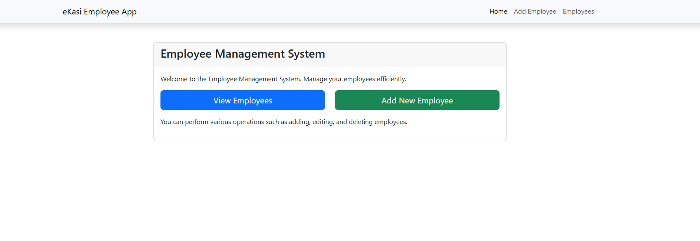
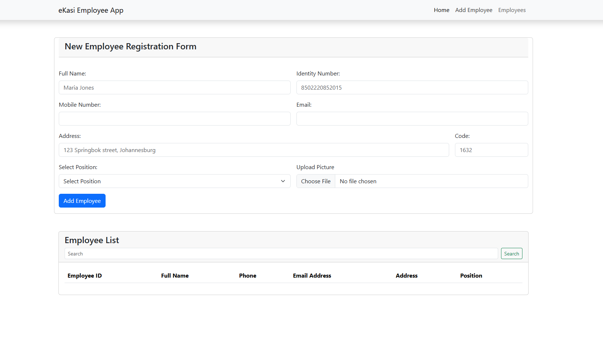

# Employee Management Application

This is an **Employee Management App** built using **React.js**, **Bootstrap** for styling, and **JSON Server** as the backend for handling CRUD operations. It allows users to manage employee information, including creating, reading, updating, and deleting employee data via a RESTful API.

## Features

### Employee Features:
1. **Home Page:**
     - Action buttons for adding new the employee.
     - Action buttons for listing all the employee.

2. **Add Employee Page:**
   - Form with the following inputs:
     - Name.
     - Email.
     - Identity Number.
     - Mobile Number.
     - Address.
     - Code.
     - Picture.
     - Position.
     - Action buttons for editing or deleting the employee.

3. **Edit Employee Page:**
   - Pre-filled form with the selected employee's information.
   - Allows the user to update:
     - Name.
     - Email.
     - Identity Number.
     - Mobile Number.
     - Address.
     - Code.
     - Button to save changes.

4. **Employee Details Page:**
   - Displays detailed information about the selected employee:
     - Name, Email, Position, Identity Number, Mobile Number, Address.
   - Action buttons to edit or delete the employee.

5. **Delete Employee Confirmation:**
   - Confirmation popup when attempting to delete an employee.
   - Button to confirm deletion.

### Navigation Bar:
- **Links:**
  - Home (Action buttons to Add employees and List all employees).
  - Add Employee (Form to add a new employee).
  - Employees (Displays the list of employees).

### RESTful API Operations (via JSON Server):
- **GET /employees:** Fetches all employees.
- **POST /employees:** Adds a new employee.
- **PUT /employees/:id:** Updates an existing employee.
- **DELETE /employees/:id:** Deletes an employee.

## Technology Stack
- **Frontend:** React.js
- **Styling:** Bootstrap
- **Backend:** JSON Server (as a REST API for CRUD operations)

## Installation

To run this project locally, follow these steps:

1. Clone the repository:
   ```bash
   git clone https://github.com/Portia-Nelly-Mashaba/Employee-app.git
   ```

2. Install the dependencies:
   ```bash
   cd employee-management-app
   npm install
   ```

3. Start the JSON server:
   ```bash
   npx json-server --watch db.json --port 5000
   ```

4. Start the React development server:
   ```bash
   npm start
   ```

5. Open the app in your browser:
   ```
   http://localhost:3000
   ```

## Images





## Future Enhancements
1. Implement user authentication for role-based access.
2. Enable bulk actions like deleting multiple employees at once.


